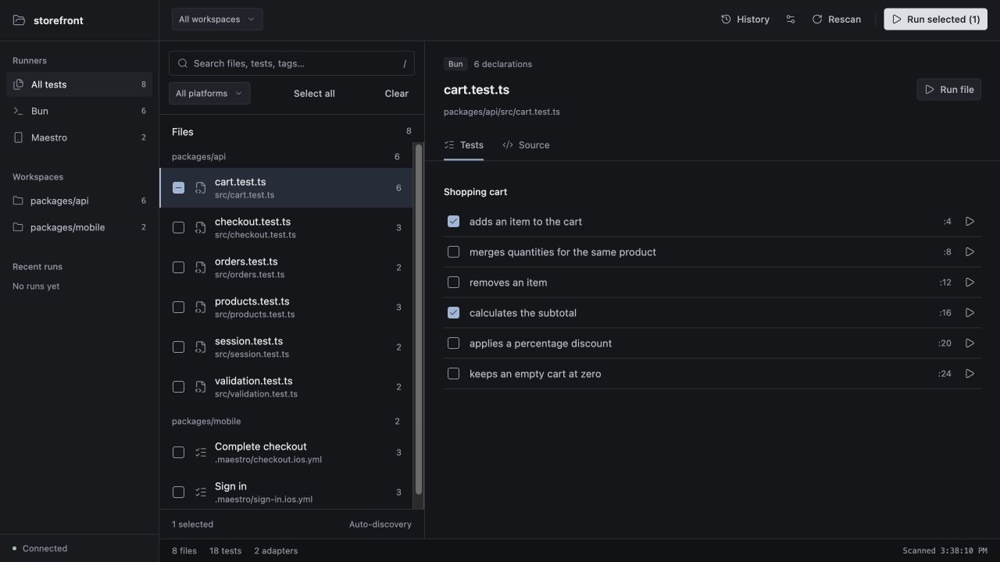
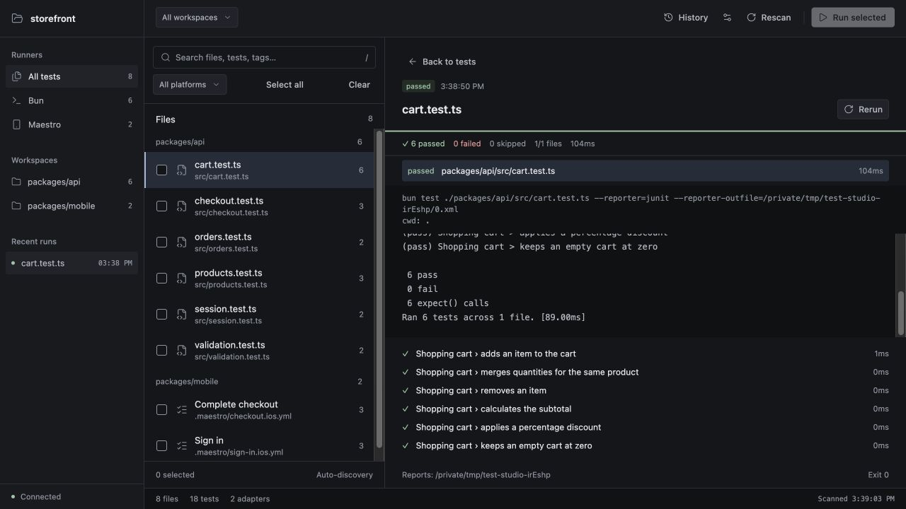

# Test Studio

[](https://www.npmjs.com/package/@kfiros/test-studio)
[](LICENSE)
[](https://nodejs.org/)

Discover and run your tests from a local browser UI or the terminal. Test Studio finds test files and declarations automatically, with built-in support for **Bun tests**, **Maestro flows**, and **custom adapters**.



[Quick start](#quick-start) · [Adapters](#extend-with-adapters) · [Browser UI](#use-the-browser-ui) · [Terminal](#run-from-the-terminal) · [Configuration](#configure-your-project) · [Contributing](development.md)

## Quick start

From the project you want to test:

```sh
npx @kfiros/test-studio
# or
bunx @kfiros/test-studio
```

Open the printed local URL. Test Studio scans the current directory; pass a path to explore another project:

```sh
npx @kfiros/test-studio /path/to/project
npx @kfiros/test-studio /path/to/project --port 4311
```

You need **Node.js 22+** with either launcher. Install your project's dependencies and the tools for the tests you want to run: Bun for Bun tests, Maestro for mobile flows. The UI comes compiled in the package, so no frontend setup is needed. Ctrl+C stops the server and active test process.

Prefer a project dependency? Run `npm install --save-dev @kfiros/test-studio` or `bun add --dev @kfiros/test-studio`. The installed command is `test-studio`.

## What you can do

- Browse tests across packages in a monorepo, with filters for runner, workspace, platform, test name, and tags.
- Run a file, selected files, or individual statically named Bun tests.
- Inspect Maestro flow steps and source, and pass a device ID or flow variables.
- Follow live output and per-test results, stop a run, or rerun failed files.
- Run the same selections from the terminal with exit codes for scripts and CI.
- Add another test framework through an adapter in your project or an installed package.

## Extend with adapters

Bun and Maestro work out of the box. Adapters let other tools use the same discovery, execution, and results UI.

| Adapter          | Discovers                                     | Runs                                                |
| ---------------- | --------------------------------------------- | --------------------------------------------------- |
| **Bun**          | JS/TS test files and static test declarations | Whole files or individual tests                     |
| **Maestro**      | YAML flows, steps, tags, and platform hints   | Complete flows                                      |
| **Your adapter** | Any file format you choose                    | A command that produces normalized results or JUnit |

Register a local adapter alongside the built-ins:

```json
{
	"adapters": ["bun", "maestro", "./tools/node-checks.mjs"]
}
```

Save this as `test-studio.config.json` and copy the included [Node checks adapter](examples/node-checks.mjs) to `tools/node-checks.mjs`. It runs files named `*.check.mjs` with Node's test runner:

```js
// example.check.mjs
import { test } from "node:test";
import assert from "node:assert/strict";

test("adds numbers", () => {
	assert.equal(1 + 1, 2);
});
```

```sh
npx @kfiros/test-studio run --runner node-checks
```

Adapters can also be installed npm packages. Install them in the project being tested, then add their package names to `adapters`. Supplying `adapters` replaces the default list, so include `bun` and `maestro` if you still want them.

See **[Writing adapters](docs/adapters.md)** for the interface, factory options, TypeScript helpers, and result parsing. Other recognized frameworks, such as Vitest, Jest, and Playwright, are inspectable but need an adapter to run.

## Use the browser UI

1. Filter the catalog by runner or workspace. Press `/` to search filenames, test names, or tags.
2. Open a file to inspect its tests, flow steps, or source.
3. Select file checkboxes or individual Bun tests, then choose **Run selected**. Use **Run file**, **Run flow**, or a test's play button for an immediate run.
4. Watch output and results. **Stop** cancels the active run; **Rerun failed** retries failed files with their original selections.



_Screenshots use a sample project; the test catalog and results come from the running application._

**History** and the sidebar show recent runs for the current server session. Discovery refreshes every five seconds as files change. Each file runs in a fresh process, one at a time.

For Maestro, open **Run settings** to choose a device ID and supply `NAME=value` variables. Start your simulator or device and make sure the target app is ready first. Platform filters narrow the catalog; they do not choose the device.

## Run from the terminal

Add `run` to execute once without the UI:

```sh
# Run all tests with enabled adapters
npx @kfiros/test-studio run

# Run only Bun tests in a package
bunx @kfiros/test-studio run --runner bun --file packages/api

# Select a test by its full name, including its suite name
npx @kfiros/test-studio run --file tests/session.test.ts --test "Session creates a session"

# Run Maestro with a device and flow variables
npx @kfiros/test-studio run --runner maestro --device simulator-id --env APP_ID=com.example.app
```

`--no-ui` is an alias for `run`. Add a project path after `run` to target another directory. `--runner` and `--file` can be repeated; all filters combine. `--test` is a case-sensitive literal substring, and `--file` takes a file or directory path, not a glob.

Output streams to the terminal and ends with results and a report directory. Exit codes are **0** for passing, **1** for failed tests or setup/selection errors, **130** for Ctrl+C, and **143** for SIGTERM. Empty selections and missing tools fail before execution.

See the [CLI reference](docs/reference.md#terminal-options-and-exit-codes) for complete selection behavior and options.

## Configure your project

Start with defaults, or generate a config and ignore file:

```sh
npx @kfiros/test-studio init
```

This creates `test-studio.config.json` and `.teststudioignore`, keeping existing files intact. It does not modify package.json.

```json
{
	"name": "My project",
	"port": 4310,
	"adapters": ["bun", "maestro"],
	"exclude": ["fixtures/generated/"],
	"respectGitignore": true,
	"timeoutMs": 1800000
}
```

Every option is optional. Config files also support TypeScript, ESM, and CommonJS. Use `--config path/to/config.ts` to select one explicitly; the path is relative to the project root. Restart Test Studio after changing config or adapter code.

Add project-specific exclusions to `.teststudioignore` using Git ignore syntax:

```gitignore
# Generated tests
fixtures/generated/

# Exclude experiments except one smoke test
experiments/*.test.ts
!experiments/smoke.test.ts
```

Ignore rules refresh automatically. Existing `.gitignore` rules are respected by default. Dependencies, build outputs, symlinks, and nested Git checkouts are skipped.

See [configuration](docs/reference.md#configuration), [ignore rules](docs/reference.md#ignore-rules), and the [JSON schema](schema.json) for the details.

## Good to know

- Discovery reads source without running it. Generated or duplicate test names can require a whole-file run; Maestro steps always run as a complete flow.
- Test Studio uses your project's runner configuration and environment. Start any required services, emulators, or application servers before running tests.
- Run trusted projects: tests, config modules, and adapters execute with your terminal's privileges. The UI server listens only on `127.0.0.1`.
- Run history lasts for the server session. Reports are stored in the printed temporary directory. Windows process-tree cancellation has not been verified.

The [usage reference](docs/reference.md) covers discovery rules, runner configuration, reporting, timeouts, and execution boundaries.

## Contributing

Want to improve the UI, add a framework, or work on the runner? Start with **[development.md](development.md)** for local setup, the UI workflow, code organization, and checks. Adapter authors can jump straight to [Writing adapters](docs/adapters.md).

## License

[MIT](LICENSE). Bundled UI dependency licenses are included in `dist/web/THIRD_PARTY_NOTICES.txt`.
